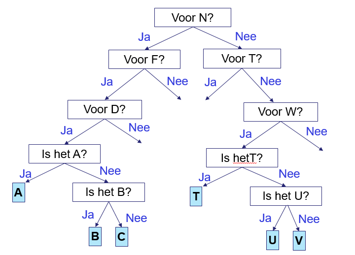
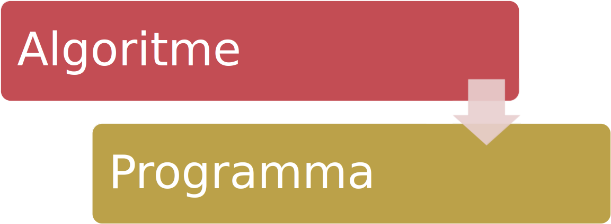

<!-- .slide: data-background-gradient="linear-gradient(to bottom right, #f1881c, #ffffff)" -->

# Basis van Programmeren

Q-highschool / Bijeenkomst 2

---

## Vandaag

-   Kennismaking
-   Wat is programmeren
-   Opfrisquiz
-   Zelf aan de slag
-   `input()` en `if`-statements
-   Afsluiting

***

## Hoi! 👋

Notes:
-   Namenlijstje
-   Namen gooien

---

## Speeddaten

We vormen een binnen- en buitencirkel.

1. Stel je nog even voor. Naam!
2. Praat met elkaar over:
   
   Welke game speel je het liefst en waarom?\
   Wat is je lievelingsserie of film en waarom?\
   Wie is je lievelingsdocent en waarom?\
   Wat is het leukste dat je ooit is overkomen?\
   Wat is voor jou het belangrijkste in het leven?\
   Wat heb je nodig om deze module te laten slagen?\
   Wat heb je anderen te bieden in deze module?

   <!-- .element: style="font-size: .8em" -->

Notes:
Na twee à drie minuten doordraaien.

***

<!-- .slide: data-background-color="black" data-background-image="assets/bijeenkomst_2/vraagteken.png" -->

## Vraag maar raak!

<!-- .element: class="r-fit-text" -->

Notes:
Eén persoon mag vragen stellen, de ander antwoord door met de ogen te
knipperen. Probeer een woord te communiceren.

---

### Algoritmisch denken

Letter voor letter?\
<small>A: 1x knipperen, B: 2x knipperen, C: 3x knipperen, ...</small>

<div class="fragment">

Problemen?

<small>

-   Veel knipperen. Hoe vaak bij het woord 'puzzel'?
-   Wat als je verkeerd hebt geteld?
-   Cijfers?
-   Punten, komma's, andere leestekens?

</small>
</div>

Notes:
Aanpak: vraag "Wat is de eerste letter?", etc.

---

In tweetallen:

1.  Bedenk een slimme oplossing om te communiceren
2.  Probeer het uit met een woord, bijvoorbeeld: "leuk"
3.  Schrijf op een blaadje:
    -   Het algoritme (hoe werkt het?)
    -   Waarom is jullie algoritme beter?
    -   Wanneer werkt jullie algoritme minder goed?

---

### Efficiëntie

Welk algoritme is sneller? Meet het aantal vragen en aantal keer
knipperen!

Bijvoorbeeld voor een 4-letter-woord:

-   Best case: <span class="fragment">AAAA</span><span class="fragment">, 4× knipperen</span>
-   Worst case: <span class="fragment">ZZZZ</span><span class="fragment">, 104× knipperen</span>
-   Dus gemiddeld: 54× knipperen... <!-- .element: class="fragment" -->

Notes:
Voor beide vier vragen.

---

### Mogelijke oplossing

Knipper één keer voor "ja", knipper twee keer voor "nee".

Voorbeeld: de letter B.

<!-- .element: style="font-size: .8em" -->

1. Voor N in het alfabet?\
Knipper één keer.\
**ABCDEFGHIJKLM**\
~~NOPQRSTUVWXYZ~~

2. Voor F in het alfabet?\
Knipper één keer.\
**ABCDE**~~FGHIJKLM~~\
~~NOPQRSTUVWXYZ~~

3. Voor C in het alfabet?\
Knipper één keer.\
**AB**~~CDEFGHIJKLMN~~\
~~OPQRSTUVWXYZ~~

4. Is het A?\
Knipper twee keer.\
~~A~~**B**~~CDEFGHIJKLM~~\
~~NOPQRSTUVWXYZ~~

<!-- .element: style="display: grid; grid-template-columns: 1fr 1fr; grid-template-rows: 1fr 1fr; font-size: .8em;" -->

---

### Mogelijke oplossing



<!-- .element: class="r-stretch" -->

Notes:
Hoeveel vragen per letter? 4 of 5

---



<!-- .element: class="r-stretch" -->

***

## Opfrisquiz

---

Hoe print je de tekst *Dit is leuk!* met Python?

- `print "Dit is leuk!"`
- `print(Dit is leuk!)`
- `print("Dit is leuk!")`
- `print('Dit is leuk!')`

<!-- .element: class="mc" -->

---

Wat print dit programma?

```python
a = 12
a = 5
print(a)
```

- 12
- 5
- 17
- Dat kun je niet weten

<!-- .element: class="mc" -->

---

Wat print dit programma?

```python
a = 12
a = a + 5
print(a)
```

- 12
- 5
- 17
- Dat kun je niet weten

<!-- .element: class="mc" -->

---

*Programmeeroefening:* **Variabelen omwisselen**

Schrijf een programma dat de waarden van twee variabelen **omwisselt**. Twee variabelen `x` en `y` zijn vooraf gedefinieerd, en bevatten elk een getal. Na uitvoering van het programma moet de oude waarde van `x` in de variabele `y` te vinden zijn en de oude waarde van `y` in de variabele `x`. Het programma hoeft geen uitvoer te geven.

---

Je wilt de waardes van de variabelen `x` en `y` omwisselen. Hoeveel
variabelen heb je nodig?

- 0
- 1
- 2
- 3

<!-- .element: class="mc" -->

***

## Aan de slag!

[*Les 2: Functies* in de syllabus](../2_functies.html)

Notes:
Tussendoor kunnen we oefeningen bespreken.

***

## Input vragen

---

Maak een papegaai, die precies terugzegt wat jij tegen de papegaai zegt.

&nbsp;

```python[|2|2-3]
print("Ik ben een papegaai!")
tekst = input("Wat zeg jij? ")
print(tekst)
```

<!-- .element: class="fragment" -->

---

<!-- .slide: data-auto-animate data-auto-animate-id="rekenmachine" -->

Een simpele rekenmachine: vraag twee getallen en print de vermenigvuldiging.

&nbsp;

```python
a = input("Eerste getal: ")
b = input("Tweede getal: ")
print(a * b)
```

<!-- .element: class="fragment" data-id="rekenmachine-code" -->

&nbsp;

```text
TypeError: can't multiply sequence by 
           non-int of type 'str'
```

<!-- .element: class="fragment" -->

---

<!-- .slide: data-auto-animate data-auto-animate-id="rekenmachine" -->

Een simpele rekenmachine: vraag twee getallen en print de vermenigvuldiging.

&nbsp;

```python
a = int(input("Eerste getal: "))
b = int(input("Tweede getal: "))
print(a * b)
```

<!-- .element: data-id="rekenmachine-code" -->

Notes:
En wat als we met kommagetallen willen rekenen?

***

## `if`/`else`-statements

---

### Keuzes maken

Een bot die alleen iets doet als je er Hallo tegen zegt.

```python
tekst = input("Hoi! ")
if tekst == "Hallo":
    print("Tot ziens!")
```
<!-- .element: class="fragment" -->

---

<div class="columns" style="font-size: .8em">
<div>

`=`

<!-- .element: style="font-size: 6em; line-height: .6;" -->

- Een waarde in een variabele zetten
  <!-- .element: class="fragment" data-fragment-index="1" -->
- Spreek uit als 'wordt'
  <!-- .element: class="fragment" data-fragment-index="2" -->

</div>
<div>

`==`

<!-- .element: style="font-size: 6em; line-height: .6;" -->

- Twee waardes vergelijken
  <!-- .element: class="fragment" data-fragment-index="1" -->
- Spreek uit als 'is'
  <!-- .element: class="fragment" data-fragment-index="2" -->
<li class="fragment">

    Geeft een booleaanse waarde:\
    `True` (waar) of\
    `False` (niet waar)

</li>

</div>
</div>

---

### Of anders

```python
tekst = input("Hoi! ")
if tekst == "Hallo":
    print("Tot ziens!")
else:
    print("Je moet Hallo zeggen.")
```

***

## Afsluiting

Hoe ver ben je gekomen?

Voor volgende les: zorg dat je een deel verder bent

Notes:
evt rekensom van aantal uren te besteden aan de module

---

Wat print dit programma?

```python
a = 12
b = 7
print(max(a, b))
```

-   max
-   12
-   7
-   19

<!-- .element: class="mc" -->

---

Wat print dit programma?

```python
smaller = min(14, 99
bigger = max(3, 4)
print(smaller + bigger)
```

-   28
-   SyntaxError: invalid syntax
-   102
-   NameError: smaller is not defined

<!-- .element: class="mc" -->

---

## Volgende week

Is het pasen 🐣

Volgens de planning *zelfstudie*: input() en if-statements

Vragenuur op *dinsdag om 16:15-17:00*
