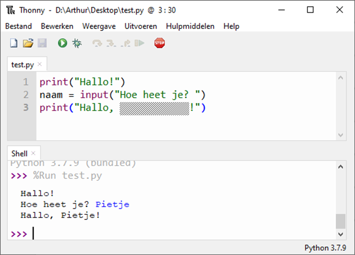

<!-- .slide: data-background-gradient="linear-gradient(to bottom right, #f1881c, #ffffff)" -->

# Basis van Programmeren

Q-highschool / Bijeenkomst 4

---

## Vandaag

- Opfrisquiz
- Code herhalen: loops
- Afsluiting

***

## Opfrisquiz

---

Welk Python commando gebruik je om iets te vragen?

- `get`
- `print`
- `input`
- `ask`

<!-- .element: class="mc" -->

---

Wat print dit programma?

```python
stad = input("Waar woon je? ")
print("Je woont in:")
print(stad)
```

```text
Waar woon je? Arnhem
```

- Je woont in: Arnhem
- Arnhem
- Je woont in:
- Je woont in:\
  Arnhem

<!-- .element: class="mc" -->

---

Wat staat op de verborgen plek?

<div class="columns">
<div>

- `" + naam + "`
- `+ naam +`
- `naam`
- `str(naam)`

<!-- .element: class="mc" -->

</div>
<div>



</div>
</div>

---

Welk van deze codes print "Hallo" als de variabele `invoer` gelijk is aan "zeg hallo"?

-   ```python
    if invoer = "zeg hallo":
        print("Hallo")
    ```
-   ```python
    if invoer == "zeg hallo":
        print("Hallo")
    ``` 
-   ```python
    if invoer = "zeg hallo":
    print("Hallo")
    ```
-   ```python
    if invoer == "zeg hallo":
    print("Hallo")
    ```

<!-- .element: class="mc" style="width: 70%; font-size:0.8em" -->

---

Wat is de output?

```python
tekst = "test"
if tekst == "tekst":
    print("Er was tekst")
else:
    print("Dit is een test")
print("Klaar")
```

<!-- .element:  -->

-   ```plaintext
    Dit is een test
    ```
-   ```plaintext
    Er was tekst
    ```
-   ```plaintext
    Dit is een test
    Klaar
    ```
-   ```plaintext
    Er was tekst
    Klaar
    ```
    
<!-- .element: class="mc grid" -->

---

<!-- .slide: style="font-size: .8em" -->

### *Programmeeroefening*: **Absolute waarde**

De absolute waarde van een getal is als volgt gedefinieerd: voor een getal `x` dat positief of 0 is, is de absolute waarde van `x` gelijk aan `x`. Wanneer `x` een negatief getal is, dan is de absolute waarde van `x` gelijk aan `-x`. 

Zo is de absolute waarde van 5 gelijk aan 5, en is de absolute waarde van -10 gelijk aan --10 oftewel 10. 

Schrijf een programma dat een geheel getal als invoer inleest en dat de abolute waarde ervan afdrukt en gebruik daarbij `if` en `else`.

***

## Code herhalen: loops

---

### Herhaling met `while`

```python
while voorwaarde:
    print("Doe iets!")
    # En meerdere regels mag ook
print("En na de loop...")
```

<!-- .element: style="max-width: 60%; float: right;" -->

---

```python
antwoord = input("Stoppen? ")
while antwoord == "nee":
    print("We stoppen niet.")
    antwoord = input("Stoppen? ")
print("Gestopt.")
```

---

Wat is de output?

```python
while True:
    print("We stoppen niet.")
print("Gestopt.")
```

-   ```plaintext
    We stoppen niet.
    Gestopt.
    ```
-   ```plaintext
    Gestopt.
    ```
-   ```plaintext
    We stoppen niet.
    ```
-   ```plaintext
    We stoppen niet.
    We stoppen niet.
    We stoppen niet.
    We stoppen niet.
    We stoppen niet.
    We stoppen niet.
    We stoppen niet.
    We stoppen niet.
    ...
    ```

<!-- .element: class="mc" style="font-size: .6em" -->

---

Wat is de output?

```python
while False:
    print("We stoppen niet.")
print("Gestopt.")
```

-   ```plaintext
    We stoppen niet.
    Gestopt.
    ```
-   ```plaintext
    Gestopt.
    ```
-   ```plaintext
    We stoppen niet.
    ```
-   ```plaintext
    We stoppen niet.
    We stoppen niet.
    We stoppen niet.
    We stoppen niet.
    We stoppen niet.
    We stoppen niet.
    We stoppen niet.
    We stoppen niet.
    ...
    ```

<!-- .element: class="mc" style="font-size: .6em" -->

---

### Oefening

Schrijf een programma dat de getallen 1 t/m 10 print. Maak gebruik van een loop.

```python
getal = 1
while getal <= 10:
    print(getal)
    getal = getal + 1
```

<!-- .element: class="fragment" -->

---

### Herhaling met `for`

&nbsp;

```python
for getal in range(1, 11):
    print(getal)
```

***

## Aan de slag!

[*Les 4* in de syllabus](../4_loops.html)

***

## De eindopdracht

[De eindopdracht staat in de syllabus](../eindopdracht.html)

***

## Afsluiting

---

Wat is de output?

```python
antwoord = "ja"
while antwoord == "ja":
    print("Oke, doen we")
    antwoord = "nee"
print("Goedemiddag")
```

<!-- .element: style="font-size: .7em" -->

-   ```plaintext
    Oke, doen we
    Goedemiddag
    ```
-   ```plaintext
    Oke, doen we
    ```
-   ```plaintext
    Goedemiddag
    ```
-   ```plaintext
    Oke, doen we
    Oke, doen we
    Oke, doen we
    Oke, doen we
    Oke, doen we
    Oke, doen we
    Oke, doen we
    Oke, doen we
    ...
    ```
<!-- .element: class="mc" style="font-size: .6em"  -->

---

Wat is de output?

```python
antwoord = "nee"
if antwoord == "ja":
    print("Oke, doen we")
else:
    print("Dan niet")
print("Goedemiddag")
```

-   ```plaintext
    Oke, doen we
    Goedemiddag
    ```
-   ```plaintext
    Oke, doen we
    ```
-   ```plaintext
    Dan niet
    Goedemiddag
    ```
-   ```plaintext
    Dan niet
    ```

<!-- .element: class="mc grid" style="font-size: .95em" -->

---

Je wilt de tafel van 7 printen. Welke Python constructie kies je?

- `if`
- `while`
- `loop`
- `for`

<!-- .element: class="mc" -->

---

## Volgende week

Vakantie!!

<div class="fragment">

## Over twee weken

Online bijeenkomst

Zorg voor een werkende camera
<div>