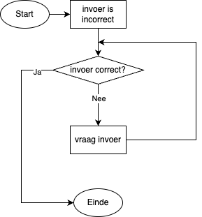
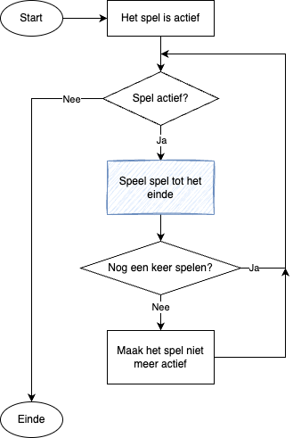

<!-- .slide: data-background-gradient="linear-gradient(to bottom right, #f1881c, #ffffff)" -->

# Basis van Programmeren

Q-vak Informatica / Bijeenkomst 6

---

## Vandaag

- Opfrisquiz
- Handige programmeerpatronen:
    - Validatie van je invoer
    - Interactieve lus
- Afsluiting

***

## Opfrisquiz

---

Met welke functie kun je de lengte van een lijst vinden?

- `length`
- `size`
- `len`
- `count`

<!-- .element: class="mc" -->

---

Wat doet `def`?

- Maakt een variabele **def**initief
- Geeft een variabele later (**def**erred) een waarde
- Geeft de standaard (**def**ault) keuze
- **Def**inieert een functie

<!-- .element: class="mc" -->

---

```python
steden = [ "Arnhem", "Nijmegen", "Groningen",
           "Enschede", "Zwolle", "Leeuwarden" ]
```

<!-- .element: style="font-size: .7em" -->

Hoe haal je "Arnhem" uit deze lijst?

- `steden[0]`
- `steden[1]`
- `steden[len(steden)]`
- `steden[len(steden) + 1]`

<!-- .element: class="mc" -->

---

```python
steden = [ "Arnhem", "Nijmegen", "Groningen",
           "Enschede", "Zwolle", "Leeuwarden" ]
```

<!-- .element: style="font-size: .7em" -->

Hoe haal je "Leeuwarden" uit deze lijst?

- `steden[0]`
- `steden[-1]`
- `steden[len(steden)]`
- `steden[len(steden) - 1]`

<!-- .element: class="mc" -->

Notes:
Zowel `steden[-1]` als `steden[len(steden) - 1]` zijn correct

---

Wat is de output?

```python
teller = 0
while teller < 2:
    print("Hallo, wereld!")
```

<!-- .element: style="font-size: .7em" -->

- ```plaintext
  Hallo, wereld!
  ```
- ```plaintext
  Hallo, wereld!
  Hallo, wereld!
  ```
- ```plaintext
  Hallo, wereld!
  Hallo, wereld!
  Hallo, wereld!
  ```
- ```plaintext
  Hallo, wereld!
  Hallo, wereld!
  Hallo, wereld!
  Hallo, wereld!
  Hallo, wereld!
    ...
  ```

<!-- .element: class="mc" style="font-size: .65em" -->

---

Schrijf een functie die twee getallen optelt.

- ```python
  def telop a b:
      return a + b
  ```
- ```python
  def telop(a, b):
      a + b
  ```
- ```python
  def telop(a, b):
      return a + b
  ```
- ```python
  def telop a b:
      a + b
  ```

<!-- .element: class="mc" -->

---

```python
steden = [ "Arnhem", "Nijmegen", "Groningen",
           "Enschede", "Zwolle", "Leeuwarden" ]
```

<!-- .element: style="font-size: .7em" -->

Wat is `steden[6]`?

- Arnhem
- Leeuwarden
- `IndexError: list index out of range` <!-- .element: style="font-size: .8em" -->
- Nijmegen

<!-- .element: class="mc" -->

---

Wat is de output?

```python
for i in range(2):
    print("Hallo, wereld!")
```

<!-- .element: style="font-size: .6em" -->

- ```plaintext
  Hallo, wereld!
  ```
- ```plaintext
  Hallo, wereld!
  Hallo, wereld!
  ```
- ```plaintext
  Hallo, wereld!
  Hallo, wereld!
  Hallo, wereld!
  ```
- ```plaintext
  Hallo, wereld!
  Hallo, wereld!
  Hallo, wereld!
  Hallo, wereld!
  Hallo, wereld!
  Hallo, wereld!
    ...
  ```

<!-- .element: class="mc" style="font-size: .6m" -->

***

## Validatie van je invoer

---

```python
getal = int(input("Voer een getal in: "))
```

&nbsp;

```plaintext
ValueError: invalid literal for int() 
            with base 10: 'a'
```

<!-- .element: class="fragment" -->

---

 <!-- .element: style="height: 100%" -->

<!-- .element: class="r-stretch" -->

---

<!-- .slide: data-auto-animate data-auto-animate-id="invoer-lus" -->

```python [1-2|3|4-5|1-5]
invoerCorrect = False
while not invoerCorrect:
    invoer = input("Voer een getal in: ")
    if invoer.isdigit():
        invoerCorrect = True
```

<!-- .element: data-id="invoer-lus" style="width: 100%" -->

Notes:
- `.isdigit()` is nieuw
- Niet heel vriendelijk, geen feedback

---

<!-- .slide: data-auto-animate data-auto-animate-id="invoer-lus" -->

```python [6-7]
invoerCorrect = False
while not invoerCorrect:
    invoer = input("Voer een getal in: ")
    if invoer.isdigit():
        invoerCorrect = True
    else:
        print("Dat is geen getal. Probeer opnieuw!")
```

<!-- .element: data-id="invoer-lus" style="width: 100%" -->

---

<!-- .slide: data-auto-animate data-auto-animate-id="invoer-lus-func" -->

```python [|1,9]
def getalInvoer():
    invoerCorrect = False
    while not invoerCorrect:
        invoer = input("Voer een getal in: ")
        if invoer.isdigit():
            invoerCorrect = True
        else:
            print("Dat is geen getal. Probeer opnieuw!")
    return int(invoer)
```
<!-- .element: data-id="invoer-lus-func" style="width: 100%" -->

---

<!-- .slide: data-auto-animate data-auto-animate-id="invoer-lus-func" -->

```python [11-12|]
def getalInvoer():
    invoerCorrect = False
    while not invoerCorrect:
        invoer = input("Voer een getal in: ")
        if invoer.isdigit():
            invoerCorrect = True
        else:
            print("Dat is geen getal. Probeer opnieuw!")
    return int(invoer)

a = getalInvoer()
print("Je hebt het getal", a, "ingevoerd")
```
<!-- .element: data-id="invoer-lus-func" style="width: 100%" -->

---

### Oefening

Oefening 6.1 t/m 6.3 van [*Les 6* in de syllabus](../6_programma_patronen.html)

> Tip: maak deze opdrachten al in Thonny of Visual Studio Code. Heb je die nog niet? Installeer ze, heb je ook nodig voor de eindopdracht.

***

## Interactieve lus

De game loop <!-- .element: class="fragment" -->

---

 <!-- .element: style="height: 100%" -->

<!-- .element: class="r-stretch" -->

---

```python [1-2|4|4-6|8-12|5-12|14|5-12|]
def vraagJaNee(bericht): # Zie oefening 6.2
    pass # Geeft "J" of "N" terug

spelActief = True
while spelActief:
    # Speel het spel

    doorgaan = vraagJaNee("Wil je doorspelen?")
    if doorgaan == "N":
        spelActief = False
    else:
        print("We spelen nog een keer!")

print("Bedankt voor het spelen!")
```

<!-- .element: style="width: 107%; height: calc(14em * 1.2 + 12px)" -->

***

## Eindopdracht

Gesprekken: plan jezelf in via het bestand *Gespreksplanning.xlsx* in Teams.

---

### Een gesprek?

Twee soorten vragen:

1. Hoe werkt je programma?
2. Hoe zou je \<een wijziging\> aanpakken?

Notes:
Vragen: hoe ziet een goed antwoord eruit?

1. evt wat vervolgvragen. Slecht antwoord: kan dingen niet uitleggen. Goed antwoord: duidelijke uitleg bij de eerste vraag, niet per se van boven naar beneden.
2. kleine wijziging, tot uitbreiding. Welke constructies, grote lijnen, hoe in jouw programma, evt reflectie. Hoeft geen code te dicteren.

---

### Aan de slag!

Verder met CSCircles, of

[Eindopdracht](../eindopdracht.html)

***

## Afsluiting

---

```python
planten = [ 
    "Madeliefje", "Tulp", "Klaproos", "Narcis", 
    "Paardenbloem", "Fluitenkruid", "Jasmijn"
]
```

<!-- .element: style="width: 100%" -->

Wie is `planten[len(planten) - 2]`?

- Jasmijn
- Fluitenkruid
- Paardenbloem
- Narcis

<!-- .element: class="mc" -->

---

Schrijf een functie die iemand een fijne zomer wenst.

```python
wens("Jip", 2026)
```
<!-- .element: style="width: fit-content; text-align: center" --->

- ```python
  def wens naam jaar:
    print("Fijne zomer " + str(jaar) + ", " + naam + "!")
  ```
    <!-- .element style="margin-left: 0; margin-right: 0; width: 100%; font-size: .6em" -->
- ```python
  def wens(naam, jaar):
    print("Fijne zomer " + str(jaar) + ", " + naam + "!")
  ```
    <!-- .element style="margin-left: 0; margin-right: 0; width: 100%; font-size: .6em" -->
- ```python
  def wens naam jaar:
    print("Fijne zomer " + jaar + ", " + naam + "!")
  ```
    <!-- .element style="margin-left: 0; margin-right: 0; width: 100%; font-size: .6em" -->
- ```python
  def wens(naam, jaar):
    print("Fijne zomer " + jaar + ", " + naam + "!")
  ```
    <!-- .element style="margin-left: 0; margin-right: 0; width: 100%; font-size: .6em" -->

<!-- .element: class="mc" -->

---

## Volgende week

Laatste bijeenkomst, online!