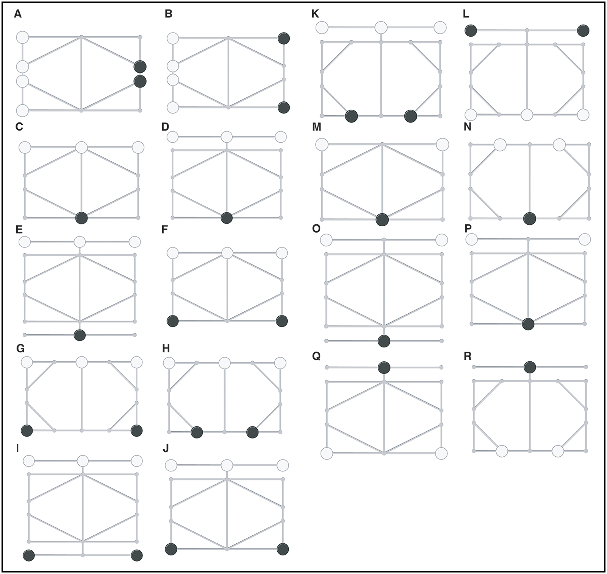

# Eindopdracht

Het spel dat jullie gaan maken is Ludus Coriovalli. Dit is een Romeins bordspel waarvan het speelbord is gevonden in het Thermenmuseum in Heerlen, Limburg. De Romeinen noemden Heerlen *Coriovallum*, vandaar de naam. Het bijzondere aan dit spel is dat niemand meer wist hoe het gespeeld werd — totdat onderzoekers van de Universiteit Maastricht in 2026 met behulp van kunstmatige intelligentie de spelregels hebben gereconstrueerd. Ze lieten een AI miljoenen potjes spelen op het bord en vergeleken het slijtagepatroon van de spelstukken met het slijtagepatroon op de originele steen. Zo ontdekten ze welke regels het beste bij het spel pasten. Het is daarmee het eerste bordspel waarvan de regels door AI zijn gereconstrueerd! Wil je er meer over weten, lees dan [dit artikel van de VRT](https://www.vrt.be/vrtnws/nl/2026/02/10/belgische-onderzoekers-onthullen-met-ai-oorsprong-oud-romeins-bo/).

Het spel is een zogeheten *jachtspel* (in het Engels: *hunt game*). Eén speler speelt met de **honden** en de andere speler speelt met de **hazen**. De honden proberen de hazen in te sluiten zodat ze niet meer kunnen bewegen. De hazen proberen zo lang mogelijk vrij te blijven.

Het spel dat je maakt, is te spelen in de console. Je hoeft dus alleen `print` te gebruiken om het speelbord te tonen en `input` om gebruikers om hun input te vragen. Het zou er dus bijvoorbeeld zo uit kunnen zien:

```
  [🐰]--[2 ]--[🐶]
   |   / |  \  |
   |  /  |   \ |
  [4 ]   |    [🐶]
   |     |     |
  [6 ]   |    [🐶]
   |  \  |   / |
   |   \ |  /  |
  [🐰]--[9 ]--[🐶]

De beurt is aan de hazen.
Welke haas mag verplaatsen? 1
Naar welke positie? 4
```

Hoe die interactie er precies uitziet en hoe je de staat van het spel weergeeft, is aan jou. Als je niet weet hoe je moet beginnen en iemand raadt je aan om met pygame aan de slag te gaan, dan moet je dat advies niet opvolgen. Dit is de **basis** van programmeren en pygame is wel een tikkie ingewikkelder dan de basis.

## Het speelbord

Het speelbord bestaat uit 10 posities, die met lijnen zijn verbonden. Stukken staan op de punten en kunnen over een lijn verschoven worden naar een aangrenzend punt. Het bord ziet er als volgt uit:

```
  [1]--[2]--[3]
   |  / | \  |
   | /  |  \ |
  [4]   |   [5]
   |    |    |
  [6]   |   [7]
   | \  |  / |
   |  \ | /  |
  [8]--[9]--[10]
```

De verbindingen zijn als volgt:

- **1**: verbonden met 2, 4
- **2**: verbonden met 1, 3, 4, 5, 9
- **3**: verbonden met 2, 5
- **4**: verbonden met 1, 2, 6
- **5**: verbonden met 2, 3, 7
- **6**: verbonden met 4, 8, 9
- **7**: verbonden met 5, 9, 10
- **8**: verbonden met 6, 9
- **9**: verbonden met 2, 6, 7, 8, 10
- **10**: verbonden met 7, 9

## De spelregels

Voor de basisvariant gelden de volgende spelregels:

Eén speler speelt met **vier honden** en de andere speler speelt met **twee hazen**. De honden beginnen rechts op het bord op de punten **3**, **5**, **7** en **10**. De hazen beginnen links op het bord op de punten **1** en **8**.

- Spelers zijn om de beurt aan zet en verplaatsen één stuk per beurt naar een aangrenzend *leeg* punt. Er wordt dus niet geslagen: stukken worden nooit van het bord verwijderd.
- De honden winnen als **beide hazen** niet meer kunnen bewegen (ze zijn ingesloten). De eindscore is het aantal rondes dat de hazen vrij konden lopen.

Verder moet je programma aan de volgende eisen voldoen:

- Het spel start met een begroeting en een korte uitleg van het spel.
- Per beurt laat je programma duidelijk het bord zien, inclusief waar de honden en hazen staan.
- De hazen krijgen als eerst de beurt om een zet te doen.
- De speler kiest welk stuk die wil verplaatsen en naar welk punt. Bij een foutieve invoer (bijvoorbeeld geen geldig punt, een punt dat niet aangrenzend is, of een punt dat bezet is) wordt de speler daarop gewezen en mag opnieuw iets invoeren.
- Het spel detecteert automatisch wanneer de honden gewonnen hebben (hazen kunnen niet meer bewegen) en print de score.
- Na afloop vraagt je programma of de spelers nog een keer willen spelen of willen stoppen.

De basisvariant is 2 sterren waard, waarmee je *maximaal* een 7 kunt halen als je verder alle punten haalt (zie verderop in deze opdracht). Als je een hoger cijfer wilt, kun je meer dingen aan het spel toevoegen voor meer sterren. Met 5 sterren kun je een 10 halen. Hieronder vind je een aantal mogelijke uitbreidingen:

### Twee rondes (0.5 sterren)

De hazen kunnen in dit spel niet winnen, dus een van de spelers zal uiteindelijk altijd verliezen. Dat is natuurlijk niet eerlijk! Daarom spelen we het spel in twee rondes: de speler die met de hazen speelde, mag in de tweede ronde met de honden spelen en vice versa. De speler die met de honden de hoogste score haalt, heeft gewonnen.

- Je vraagt de namen van de twee spelers en gebruikt tijdens de rest van het spel die namen. Twee spelers mogen niet dezelfde naam invoeren.
- Je programma kiest willekeurig welke speler in de eerste ronde met de honden begint.
- Na de eerste ronde wisselen de spelers van rol en wordt er opnieuw gespeeld. Na twee rondes wordt de winnaar bekendgemaakt.

Zet in het commentaar bovenaan je programma:

```python
# Uitbreidingen:
# - Twee rondes
```

### Plaatsingsfase (0.5 sterren)

In de basisvariant staan de stukken op vaste startposities. In deze uitbreiding beginnen de spelers met een lege bord en plaatsen de stukken om de beurt op het bord. Eerst plaatst de hondenspeler al zijn vier honden (één per beurt), daarna plaatst de hazenspeler zijn twee hazen (één per beurt). Daarna gaat het spel verder als normaal.

Bij een ongeldige plaatsing (bijvoorbeeld op een al bezet punt) vraagt je programma opnieuw wat de speler wil.

Zet in het commentaar bovenaan je programma:

```python
# Uitbreidingen:
# - Plaatsingsfase
```

### Meerdere borden (1 ster)

We weten eigenlijk niet precies hoe het bord eruit hoort te zien: de versie hierboven is de beste gok op basis van een analyse met AI, maar er zijn nog veel andere mogelijkheden die de onderzoekers hebben overwogen. Op de afbeelding hieronder zie je een aantal verschillende borden en mogelijke startposities (de witte stenen zijn de honden, de zwarte de hazen).



*Bron: [10.15184/aqy.2025.10264](https://doi.org/10.15184/aqy.2025.10264)*

Voeg nog minstens één ander bord toe aan je spel en laat de speler bij de start kiezen op welk bord er gespeeld wordt.

Zet in het commentaar bovenaan je programma:

```python
# Uitbreidingen:
# - Meerdere borden
```

### Slimme hond (0.5 tot 1 sterren)

In deze variant laat je de gebruiker kiezen of ze met twee spelers willen spelen, of tegen de computer. De computer speelt dan als de honden en probeert de hazen zo slim mogelijk in te sluiten. Bedenk een strategie waarbij de honden samenwerken om de hazen klem te zetten. Hoe slimmer je computerspeler, hoe meer punten je krijgt (0.5 voor een eenvoudige strategie (bijvoorbeeld willekeurig), 1 ster voor een sterke strategie).

Zet in het commentaar bovenaan je programma:

```python
# Uitbreidingen:
# - Slimme hond
```

### Highscore bijhouden (1.5 sterren)

Meestal laat je het niet bij één potje en wil je er meer spelen. Met deze uitbreiding houdt je spel de score per persoon bij over meerdere rondes. Gebruik een tekstbestand `score.txt` om de beste score in op te slaan (inclusief de naam van de speler). 

Wanneer er een speler is, die een nieuwe beste score heeft, dan 
1. Geef je de score weer
2. Feliciteer je de speler
3. Vraag je de naam van de speler en sla je die naam en score op in het bestand

Dit bestand lees en schrijf je in je Python code middels `write()` en `readline()`. Het bestand `score.txt` bevat precies twee regels. Op de eerste regel staat de naam van de speler met de hoogste score en op de tweede regel staat de score.

Een voorbeeld van een `score.txt`:

```
Henk
11
```

Zet in het commentaar bovenaan je programma:

```python
# Uitbreidingen:
# - Score bijhouden
```

## Beoordeling

Je programma wordt beoordeeld op drie dingen: of het goed werkt, hoeveel functionaliteit je hebt geïmplementeerd en de kwaliteit van de code die je hebt geschreven:

| Onderdeel                                                    | Punten                    |
| ------------------------------------------------------------ | ------------------------- |
| Syntactisch correct, dus geen foutmeldingen van Python bij het uitvoeren van je programma | 0 tot 10                  |
| Logisch correct, dus je programma werkt volgens de spelregels | 0 tot 10 × aantal sterren |
| Gebruik van de verschillende en juiste elementen in Python (if, for, while etc.) | 0 tot 10                  |
| Goede, duidelijke, beschrijvende variabelenamen              | 0 tot 10                  |
| Zinvol en informatief commentaar waarin je je programma uitlegt | 0 tot 10                  |

Let op: bij het aantal punten dat je voor logisch correct kunt krijgen, telt dus ook mee hoeveel sterren je in je project verwerkt hebt. Heb je het minimale spel gemaakt, dan krijg je daar maximaal 2 sterren × 10 punten = 20 punten voor. Heb je alle uitbreidingen gemaakt, dan kun je tot 5 sterren × 10 punten = 50 punten krijgen voor dat onderdeel.

Bij het gebruik van de verschillende elementen van Python (if, for, while etc.) kijken we niet alleen of je de verschillende onderdelen onder de knie hebt, maar ook of je de beste oplossing voor een probleem hebt gekozen.

De eerste 10 punten krijg je gratis, dus kun je maximaal 100 punten verdienen. Je eindcijfer is het aantal punten gedeeld door 10.

### Samenwerken

Soms is het fijn om samen te werken voor een eindopdracht. Voor de meeste eindopdrachten bij Informatica Q-Highschool is dit wel mogelijk. Voor de module Basis van Programmeren met Python is samenwerken **niet** toegestaan. We willen namelijk weten wat _jij_ kan. Daarom hebben we besloten dat je voor deze module de eindopdracht alleen maakt (dus ook niet met intensieve hulp van een broer/zus/vriend/kennis die wel goed kan programmeren).

### In gesprek

Omdat we graag willen weten hoe je tot jouw uitwerking van de eindopdracht bent gekomen, selecteren we een aantal leerlingen en vragen hen op gesprek. Als we je niet in de les hebben gezien of we hebben het idee dat je je code niet zelf hebt geschreven, dan kun je natuurlijk sowieso rekenen op een uitnodiging. Als je hiervoor wordt gekozen, dan wordt je eindcijfer na afloop van dit gesprek bepaald. Wil je zelf graag iets uitleggen over je code? Geef dan bij je docent aan dat je ook graag een beoordelingsgesprek wilt hebben.

Tijdens zo'n gesprek krijg je eerst de kans om je programma te demonstreren en vervolgens zal de docent aan de hand van je ingeleverde code je enkele vragen stellen. Je mag uitleggen wat bepaalde stukken code doen, hoe je ze geschreven hebt en welke keuzes je daarbij gemaakt hebt.

### Code kopiëren?

Je mag externe bronnen gebruiken als hulp bij het maken van je spel, want daar kun je veel van leren. Je mag ook stukjes code overnemen, maar die moet je wel uitgebreid van commentaar voorzien om uit te leggen wat die code doet (minstens 1 regel commentaar per regel code!) en in commentaar de bron vermelden. De bron vermelden betekent dat je een link naar de exacte bron toevoegt, dus "uit een video op YouTube" is geen bronvermelding! Een link naar de code is minimaal wat we verwachten. Indien de code via persoonlijke communicatie gedeeld, vermeld dan minstens de naam van de persoon en jouw relatie tot die persoon. Gebruik `# BRON:` om duidelijk aan te geven dat dit een bronvermelding is en zodat wij het makkelijk terug kunnen vinden. Bijvoorbeeld:

```python
# BRON: https://rosettacode.org/wiki/Reverse_words_in_a_string#Python
# Draai de volgorde van woorden in elke regel van de variabele tekst om, 
# dus deze twee regels worden dan:
# om, tekst variabele de van regel elke in woorden van volgorde de Draai
# dan: worden regels twee deze dus
# Eerst wordt de tekst per regel gesplitst, en loopen we over elke regel
for line in text.split("\n"):
    # Elke regel splitsen we dan bij elke spatie (dat is standaard met split)
    # en met [::-1] word dan die lijst van woorden omgedraaid. " ".join plakt
    # de woorden weer aan elkaar met spaties ertussen en dat wordt geprint.
    print(" ".join(line.split()[::-1]))
```

Ook code uit ChatGPT en andere chatbots dien je van een bronvermelding te voorzien. Zet dan ook de prompt die je hebt gebruikt in je commentaar.

Het is uitdrukkelijk niet de bedoeling dat je grote blokken code of het hele spel kopieert. In dat geval zien we het als plagiaat en zullen we daar ook naar handelen. Voor diegenen die dit ingewikkeld vinden: meer dan 5 regels is een groot blok.

## Tips voor een goeie eindopdracht

- Volg het stappenplan van {ref}`programma_schrijven`.
- Begin met het bord en de verbindingen. Sla deze op in een dictionary of een lijst van lijsten.
- Test eerst of de bewegingen werken voordat je de spellogica toevoegt.
- Speel je spel zelf!
- Nog beter: laat het testen door anderen!
- Probeer je eigen spel te breken door opzettelijk foute invoer te geven.
