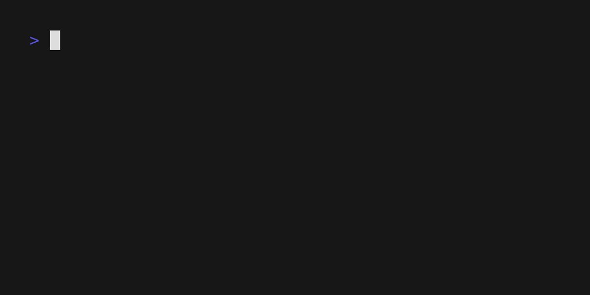

# Eindopdracht

Het spel dat jullie gaan maken is NIM. NIM is een eeuwenoud spel. Volgens sommige mensen wordt het al voor onze jaartelling begonnen is in Azië gespeeld. In 1901 is het spel NIM officieel opgeschreven en gepubliceerd. Leuk detail is dat de eerste analoge gamecomputer ooit in 1940 is gemaakt om dit spel te kunnen spelen. De naam? *Nimatron*. Twaalf jaar later heeft een Engelsman op de eerste commercieel beschikbare computer, de Ferranti, de eerste digitale versie geprogrammeerd. Dus in 1952 was dit de eerste videogame! *Nimrod* is de naam. De legendarische Britse informatica-wetenschapper Alan Turing heeft dit spel toen ook gespeeld! Voor extra coolness: er is in de jaren ’60 van de vorige eeuw een plastic versie van dit spel gemaakt. Dr Nim. Wil je er meer over weten, kijk [dit (Engelstalige) filmpje](https://www.youtube.com/watch?v=9KABcmczPdg).

Het spel dat je maakt, is te spelen in de console. Je hoeft dus alleen `print` te gebruiken om het speelbord te tonen en `input` om gebruikers om hun input te vragen. Het zou er dus bijvoorbeeld zo uit kunnen zien:



Hoe die interactie er precies uitziet en hoe je de staat van het spel weergeeft, is aan jou. Als je niet weet hoe je moet beginnen en iemand raadt je aan om met pygame aan de slag te gaan, dan moet je dat advies niet opvolgen. Dit is de **basis** van programmeren en pygame is wel een tikkie ingewikkelder dan de basis.

## De spelregels

Voor de basisvariant gelden de volgende spelregels:

De kern van het spel is dat je van een hoeveelheid steentjes telkens 1, 2 of 3 stenen wegpakt. Twee spelers pakken om de beurt 1, 2 of 3 stenen weg. Het spel is afgelopen wanneer er geen stenen meer gepakt kunnen worden. De speler, die de laatste steen of laatste stenen pakt, heeft gewonnen. In feite is de speler, die het bord met 1, 2 of 3 stenen pakken leeg kan maken, de winnaar. In de basisvariant zijn er twee beschikbare spelvormen:

1. Je begint met stapel van 20 stenen. De spelers nemen beurtelings 1, 2 of 3 stenen van de stapel.
2. Je begint met vier stapels van ieder 15 stenen. Bij aanvang van het spel heeft elke stapel hetzelfde aantal stenen. De speler nemen beurtelings 1, 2 of 3 stenen van één stapel. Je mag niet van stapel 1 en stapel 2 tegelijk iets pakken. Je kiest dus eerst een stapel, en vervolgens het aantal stenen dat je van de stapel wil pakken.

Verder moet je programma aan de volgende eisen voldoen:

- Het spel start met een begroeting en een korte uitleg van het spel.
- Je vraagt de namen van de twee spelers en gebruikt tijdens de rest van het spel die namen. Twee spelers mogen niet dezelfde naam invoeren.
- Je vraagt welke variant van het spel (met één of vier stapels) de spelers willen spelen.
- Je programma kiest willekeurig welke speler mag beginnen.
- Spelers mogen kiezen of ze 1, 2 of 3 stenen pakken. Bij een foutieve invoer (bijvoorbeeld niet een getal, of een getal anders dan 1, 2 of 3) wordt de speler daarop gewezen en mogen ze opnieuw iets invoeren. Ook mag een speler natuurlijk niet meer stenen pakken dan op de stapel liggen.
- Bij elke ronde laat je programma duidelijk zien hoeveel stenen er op elke stapel liggen
- Het spel is afgelopen als een speler gewonnen heeft. Je programma print welke speler het spel gewonnen heeft en vraagt vervolgens of de gebruiker nog een keer wil spelen of dat het programma moet sluiten. Als de gebruiker nog een keer wil spelen, start het spel opnieuw en als de gebruiker wil stoppen, dan sluit het programma (uiteraard).

De basisvariant is 2 sterren waard, waarmee je *maximaal* een 7 kunt halen als je verder alle punten haalt (zie verderop in deze opdracht). Als je een hoger cijfer wilt, kun je meer dingen aan het spel toevoegen voor meer sterren. Met 5 sterren kun je een 10 halen. Hieronder vind je een aantal mogelijke uitbreidingen:

### Flexibel NIM (0.5 sterren)

In de basisvariant wordt gespeeld met één stapel van 20 stenen of vier stapels van 15 stenen. In deze uitbreiding kiezen de spelers zelf met hoeveel stapels en hoeveel stenen op iedere stapel ze willen spelen. In de eerste spelvorm vraag je de spelers om het aantal stenen dat ze op de stapel willen leggen en in de tweede vraag je het aantal stapels en het aantal stenen per stapel. Iedere stapel krijgt dezelfde hoeveelheid stenen.

Er geld een minimum van zes stenen bij stapel, in beide spelvormen. Bij de tweede spelvorm is twee het minimale aantal stapels. Bij een ongeldige waarde vraagt je programma opnieuw wat de speler wil.

Zet in het commentaar bovenaan je programma:

```python
# Uitbreidingen:
# - Flexibel NIM
```

### Geen herhaling (0.5 sterren)

Het is voor een speler niet toegestaan om twee keer achter elkaar hetzelfde aantal stenen te pakken. 

- Tommie pakt 2 stenen.
- Ieniemienie pakt 1 steen.
- Tommie heeft in de vorige ronde 2 stenen gepakt, dus kan nu kiezen uit 1 of 3 stenen. Hij pakt 1 steen.
- Ieniemienie heeft in de vorige ronde 1 steen gepakt, dus kan nu kiezen uit 2 of 3 stenen. Zij pakt nu 3 stenen.
- Tommie kan nu kiezen tussen 2 of 3 stenen. Hij gaat voor 3.
- Ieniemienie kan kiezen tussen 1 en 2, en kiest voor 2 stenen.
- Enzovoorts...

Als het voor een speler niet mogelijk is om een aantal stenen te pakken, bijvoorbeeld omdat er op iedere stapel nog maar één steen ligt en de speler in de vorige ronde één steen heeft gepakt, dan wordt die speler overgeslagen. (Je programma laat ook weten dat een speler is overgeslagen.) In de ronde daarna heeft de speler weer vrije keus uit 1, 2 of 3 stenen.

Zet in het commentaar bovenaan je programma:

```python
# Uitbreidingen:
# - Geen herhaling
```

### Toevoegen (0.5 sterren)

Iedere speler mag per spel één ronde kiezen om niet een aantal stenen te pakken, maar om 1, 2 of 3 stenen toe te voegen. Een speler mag echter niet meer stenen neerleggen dan ze tot dan toe gepakt hebben. In de eerste ronde mag dus geen enkele speler stenen bijleggen en als een speler in een ronde heeft gekozen om stenen bij te leggen, dan mogen ze dat daarna niet nogmaals doen. Als het voor een speler niet mogelijk is om stenen bij te leggen, dan mag je programma er ook niet naar vragen of een speler dat wil.

Zet in het commentaar bovenaan je programma:

```python
# Uitbreidingen:
# - Toevoegen
```

### Leegmaker speelt door (0.5 sterren)

In de spelvorm met meerdere stapels is er een extra regel: als een speler een stapel leeg heeft gemaakt, dan krijgt die speler een extra beurt in die ronde. Bekijk bijvoorbeeld de volgende situatie:

```
    o 
    o o
o o o o
1 1 3 2
```

De speler die nu aan zet is, kan steeds een hele stapel leegmaken en dus het spel winnen.

Zet in het commentaar bovenaan je programma:

```python
# Uitbreidingen:
# - Leegmaker speelt door
```

### Dr. NIM (0.5 tot 1 sterren)

In deze variant laat je de gebruiker kiezen of ze met twee spelers willen spelen, of tegen de computerspeler Dr. NIM. Dr. NIM probeert daarbij de optimale strategie aan te houden voor de basisvariant. Als je ook andere uitbreidingen hebt gekozen, dan kun je Dr. NIM uitbreiden om daar zoveel mogelijk rekening mee te houden (voor meer sterren).

Zet in het commentaar bovenaan je programma:

```python
# Uitbreidingen:
# - Dr. NIM
```

:::{admonition} Competitie
:class: tip

Bij voldoende animo houden we een competitie tussen jullie verschillende Dr. NIM spelers. Om mee te doen moet je alle uitbreidingen ondersteunen. Als hier interesse voor is, spreken we af hoe je programma moet lezen en schrijven zodat de verschillende programma's met elkaar kunnen communiceren.

:::

## Beoordeling

Je programma wordt beoordeeld op drie dingen: of het goed werkt, hoeveel functionaliteit je hebt geïmplementeerd en de kwaliteit van de code die je hebt geschreven:

| Onderdeel                                                    | Punten                    |
| ------------------------------------------------------------ | ------------------------- |
| Syntactisch correct, dus geen foutmeldingen van Python bij het uitvoeren van je programma | 0 tot 10                  |
| Logisch correct, dus je programma werkt volgens de spelregels | 0 tot 10 × aantal sterren |
| Gebruik van de verschillende en juiste elementen in Python (if, for, while etc.) | 0 tot 10                  |
| Goede, duidelijke, beschrijvende variabelenamen              | 0 tot 10                  |
| Zinvol en informatief commentaar waarin je je programma uitlegt | 0 tot 10                  |

Let op: bij het aantal punten dat je voor logisch correct kunt krijgen, telt dus ook mee hoeveel sterren je in je project verwerkt hebt. Heb je het minimale spel gemaakt, dan krijg je daar maximaal 2 sterren × 10 punten = 20 punten voor. Heb je alle uitbreidingen gemaakt, dan kun je tot 5 sterren × 10 punten = 50 punten krijgen voor dat onderdeel.

Bij het gebruik van de verschillende elementen van Python (if, for, while etc.) kijken we niet alleen of je de verschillende onderdelen onder de knie hebt, maar ook of je de beste oplossing voor een probleem hebt gekozen.

De eerste 10 punten krijg je gratis, dus kun je maximaal 100 punten verdienen. Je eindcijfer is het aantal punten gedeeld door 10.

### In gesprek

Omdat we graag willen weten hoe je tot jouw uitwerking van de eindopdracht bent gekomen, selecteren we ongeveer de helft van de uitwerkingen en vragen deze leerlingen op gesprek. Als we je niet in de les hebben gezien of we hebben het idee dat je je code niet zelf hebt geschreven, dan kun je natuurlijk sowieso rekenen op een uitnodiging. Als je hiervoor wordt gekozen, dan wordt je eindcijfer na afloop van dit gesprek bepaald. Wil je zelf graag iets uitleggen over je code? Geef dan bij je docent aan dat je ook graag een beoordelingsgesprek wilt hebben.

Tijdens zo'n gesprek krijg je eerst de kans om je programma te demonstreren en vervolgens zal de docent aan de hand van je ingeleverde code je enkele vragen stellen. Je mag uitleggen wat bepaalde stukken code doen, hoe je ze geschreven hebt en welke keuzes je daarbij gemaakt hebt.

### Code kopiëren?

Je mag externe bronnen gebruiken als hulp bij het maken van je spel, want daar kun je veel van leren. Je mag ook stukjes code overnemen, maar die moet je wel uitgebreid van commentaar voorzien om uit te leggen wat die code doet (minstens 1 regel commentaar per regel code!) en in commentaar de bron vermelden. De bron vermelden betekent dat je een link naar de exacte bron toevoegt, dus "uit een video op YouTube" is geen bronvermelding! Een link naar de code is minimaal wat we verwachten. Indien de code via persoonlijke communicatie gedeeld, vermeld dan minstens de naam van de persoon en jouw relatie tot die persoon. Gebruik `# BRON:` om duidelijk aan te geven dat dit een bronvermelding is en zodat wij het makkelijk terug kunnen vinden. Bijvoorbeeld:

```python
# BRON: https://rosettacode.org/wiki/Reverse_words_in_a_string#Python
# Draai de volgorde van woorden in elke regel van de variabele tekst om, 
# dus deze twee regels worden dan:
# om, tekst variabele de van regel elke in woorden van volgorde de Draai
# dan: worden regels twee deze dus
# Eerst wordt de tekst per regel gesplitst, en loopen we over elke regel
for line in text.split("\n"):
    # Elke regel splitsen we dan bij elke spatie (dat is standaard met split)
    # en met [::-1] word dan die lijst van woorden omgedraaid. " ".join plakt
    # de woorden weer aan elkaar met spaties ertussen en dat wordt geprint.
    print(" ".join(line.split()[::-1]))
```

Ook code uit ChatGPT en andere chatbots dien je van een bronvermelding te voorzien. Zet dan ook de prompt die je hebt gebruikt in je commentaar.

Het is uitdrukkelijk niet de bedoeling dat je grote blokken code of het hele spel kopieert. In dat geval zien we het als plagiaat en zullen we daar ook naar handelen. Voor diegenen die dit ingewikkeld vinden: meer dan 5 regels is een groot blok.
