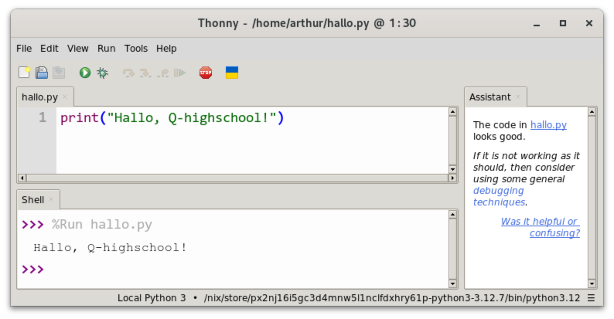
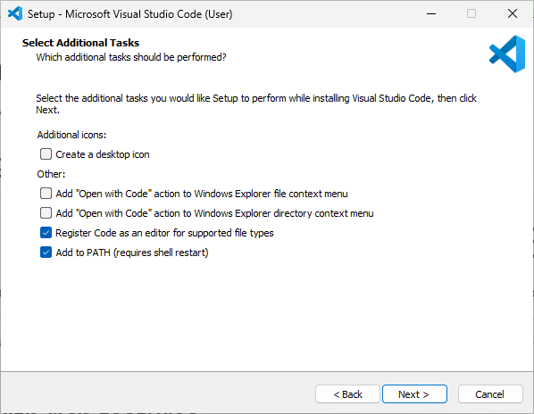
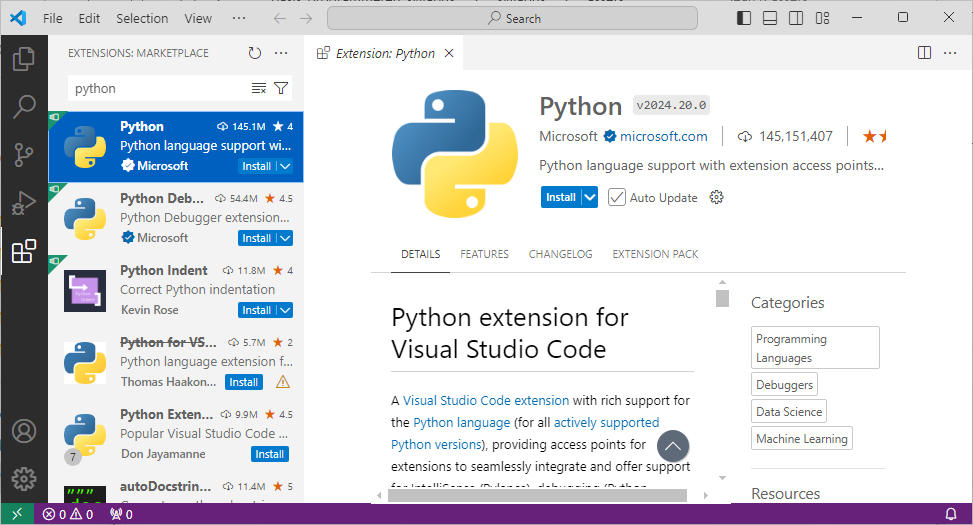
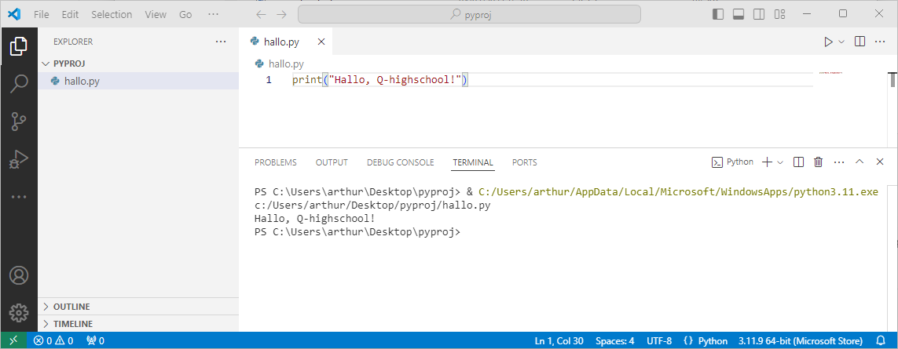

# Programmeeromgevingen

De oefeningen van CSCircles en W3Schools kun je direct op die websites maken, zonder dat je extra software nodig hebt. Als je meer wilt experimenteren, of met de eindopdracht aan de slag gaat, heb je een programmeeromgeving nodig waarin je helemaal je eigen gang kunt gaan. Je hebt namelijk een programma nodig dat de Python code die je schrijft, begrijpt en uitvoert. We hebben een aantal suggesties:

## Thonny

Thonny is een ontwikkelomgeving gericht op beginners. Het is een eenvoudige omgeving en daardoor raak je niet snel de weg kwijt. Het is ook vrij makkelijk te installeren. Ga naar de [website van Thonny](https://thonny.org/), kies rechtsboven jouw besturingssysteem en volg de instructies. Kies voor Windows bij voorkeur de Installer, maar als je geen administratorrechten op jouw computer hebt, kun je ook de Portable variant proberen.

In Thonny kun je je code uitvoeren door op de groene knop met het witte play symbool te klikken. De resultaten zie je dan onderin in het venster *Shell*. Bij foutmeldingen krijg je aan de rechterkant hulp van die assistent. Als je je code stap voor stap wilt uitvoeren en precies zien wat de waardes van variabelen bij elke stap zijn, dan kun je de *Debugger* gebruiken. Klik daarvoor op de groene kever naast de uitvoeren-knop.

## Visual Studio Code

Visual Studio Code (ook wel VS Code) is een populaire code editor die door professionals gebruikt wordt met allerlei programmeertalen, maar Python wordt ook goed ondersteund. Voordat je VS Code installeert, moet je wel zelf Python installeren. Voor Windows kun je [Python in de Windows Store](https://www.microsoft.com/store/productId/9NRWMJP3717K) vinden en meteen installeren. Mocht dat niet werken, dan kun je voor jouw systeem de juiste instructies vinden op de [Python website](https://www.python.org/downloads/).

Visual Studio Code kun je installeren vanaf [hun website](https://code.visualstudio.com/) en de installatie spreekt redelijk voor zich. De meeste standaard-opties zijn prima, maar het is aan te raden om ook de *Add 'Open with Code' action to Windows Explorer ...* opties aan te vinken.

Nadat je VS Code hebt geïnstalleerd, moet je nog een extensie voor Python installeren:

Als je dan een bestand opslaat met de *.py* extensie, herkent VS Code het als een Python bestand en kun je het ook uitvoeren met de play-knop rechtsboven in beeld:

## PyCharm

PyCharm is een uitgebreide Python IDE, een Integrated Development Environment. Dat betekent dat bijna alles wat je ook maar nodig zou kunnen hebben is inbegrepen, maar daardoor is het ook een wat zwaarder programma om uit te voeren. Heb je een wat langzamere laptop, dan is PyCharm niet aan te raden.

Om PyCharm te gebruiken, moet je wel zelf Python installeren. Voor Windows kun je [Python in de Windows Store](https://www.microsoft.com/store/productId/9NRWMJP3717K) vinden en meteen installeren. Mocht dat niet werken, dan kun je voor jouw systeem de juiste instructies vinden op de [Python website](https://www.python.org/downloads/).

Download als dat klaar is PyCharm Community Edition [hier](https://www.jetbrains.com/pycharm/download/). Bij de installatie, selecteer *Add launchers dir to the PATH*, *Create Associations - .py* en *Add “Open Folder as Project”*. Als alles gereed is kan je beginnen met het instellen. Open PyCharm, accepteer de *Terms and Conditions* en kies je favoriete theme. Plugins zijn niet nodig, sla deze over. Klik dan op *Create New Project*. Kies de gewilde locatie op je PC waar je het project wil neerzetten en de naam van het project. Klik dan op *Project Interpreter*. Selecteer *Existing Interpreter* en kies *Python 3.x*. Als deze er niet tussen staat, klik op de drie puntjes, *System Interpreter* en selecteer de enige optie. Klik op *OK* en daarna *Create*.

Je hebt nu je eerste project! Om een nieuw bestand te maken klik je met de rechter-muisknop op het mapje met de naam die je het project gegeven hebt, onder *Project*. Selecteer *New*, *Python File*. Copy-paste `print("hi")` in het bestand dat je net gemaakt hebt en klik bovenin op tab *Run, Run* (of klik Shift + F10). Je ziet onder in beeld een zwart scherm opkomen waar 'hi' in staat.

Nu weet je hoe je PyCharm gebruikt! Verdere informatie kan je vinden bij de [documentatie van JetBrains](https://www.jetbrains.com/help/pycharm/quick-start-guide.html).

Je mag altijd een andere editor gebruiken dan de drie die we hier genoemd hebben, maar dan moet je zelf uitzoeken hoe je de Python interpreter instelt (als dat nodig is).
